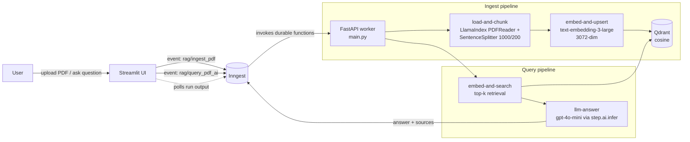

# Python RAG Agent

**An event-driven Retrieval-Augmented Generation (RAG) service.** Upload PDFs, ask questions, and get answers grounded in your own documents with sources cited. Each step (ingest, embed, retrieve, generate) runs as a durable, observable, retryable workflow step.


---

## Why this project

Most RAG demos are one script: load a file, embed it, call the LLM, print the answer. That falls apart in production. Embedding calls get rate-limited, LLM requests time out, the same file gets uploaded twice, and nobody can tell which step failed.

I built this one around the problems a customer deployment actually runs into:

| Production concern | How it's handled here |
|---|---|
| **Flaky external APIs** (OpenAI timeouts, 429s) | Each stage is an Inngest `step.run` that is checkpointed and retried on its own. A failed LLM call does not re-embed the whole PDF. |
| **Cost and abuse control** | Ingestion is **throttled** (2/min) and **rate-limited per document** (1 per `source_id` every 4h), so duplicate uploads don't burn embedding spend. |
| **Idempotency** | Chunk IDs are deterministic (`uuid5(source_id:index)`), so re-ingesting a document **upserts** instead of duplicating vectors. |
| **Observability** | Every run, step, input, output, and LLM call shows up in the Inngest dashboard. You can debug a bad answer by looking at the exact chunks that were retrieved. |
| **Hallucination control** | The system prompt restricts the model to retrieved context, uses a low temperature (0.2), and returns **sources** with every answer. |
| **Decoupled UI and backend** | The UI only emits events. The worker can scale, redeploy, or move to another host without touching the frontend. |

---

## Architecture



### Ingest flow (`rag/ingest_pdf`)
1. **load-and-chunk**: parse the PDF with LlamaIndex's `PDFReader` and split it into ~1000-token chunks with 200-token overlap, so context survives across chunk boundaries.
2. **embed-and-upsert**: batch-embed the chunks with `text-embedding-3-large`, then upsert them into Qdrant with `{source, text}` payloads under deterministic IDs.

### Query flow (`rag/query_pdf_ai`)
1. **embed-and-search**: embed the question and pull the top-k most similar chunks (cosine similarity) along with their source documents.
2. **llm-answer**: build a context-grounded prompt and call `gpt-4o-mini` through `step.ai.infer`. The LLM request is offloaded to Inngest, so it is logged, retried, and doesn't block a worker.

---

## Tech stack

- **API / worker:** FastAPI + Uvicorn
- **Orchestration:** [Inngest](https://www.inngest.com/) (durable functions, step retries, throttling, rate limits, AI inference steps)
- **Parsing & chunking:** LlamaIndex (`PDFReader`, `SentenceSplitter`)
- **Embeddings:** OpenAI `text-embedding-3-large` (3072-dim)
- **Vector store:** Qdrant (cosine distance)
- **LLM:** OpenAI `gpt-4o-mini`
- **Typed contracts:** Pydantic models between steps (`custom_types.py`)
- **Frontend:** Streamlit
- **Tooling:** `uv` for dependency management

---

## Project structure

```
.
├── main.py            # FastAPI app + Inngest functions (ingest & query pipelines)
├── data_loader.py     # PDF loading, chunking, OpenAI embeddings
├── vector_db.py       # Qdrant wrapper: collection bootstrap, upsert, search
├── custom_types.py    # Pydantic models passed between workflow steps
├── streamlit_app.py   # Upload + Q&A UI, emits events and polls for results
├── pyproject.toml     # Dependencies (managed with uv)
└── .env.example       # Required environment variables
```

---

## Quickstart

**Prerequisites:** Python 3.14, [uv](https://docs.astral.sh/uv/), Docker, Node.js (for the Inngest dev server), and an OpenAI API key.

**1. Clone and install**
```bash
git clone https://github.com/ibm777p2/python-rag-agent.git
cd python-rag-agent
uv sync
cp .env.example .env   # then add your OPENAI_API_KEY
```

**2. Start Qdrant**
```bash
docker run -d --name qdrant-rag -p 6333:6333 -v "$(pwd)/qdrant_storage:/qdrant/storage" qdrant/qdrant
```

**3. Start the worker (FastAPI + Inngest functions)**
```bash
uv run uvicorn main:app --port 8000
```

**4. Start the Inngest dev server** (dashboard at http://127.0.0.1:8288)
```bash
npx inngest-cli@latest dev -u http://127.0.0.1:8000/api/inngest --no-discovery
```

**5. Launch the UI**
```bash
uv run streamlit run streamlit_app.py
```

Upload a PDF, wait for the ingest run to finish in the Inngest dashboard, then ask a question.

### Trigger it without the UI
You can send events straight to the Inngest dev server, which is useful for integrating with an existing customer system:

```bash
curl -X POST http://127.0.0.1:8288/e/dev -H "Content-Type: application/json" -d '{"name": "rag/query_pdf_ai", "data": {"question": "What are the key takeaways?", "top_k": 5}}'
```

---

## Engineering decisions and trade-offs

- **Events instead of synchronous REST.** Ingesting a large PDF can take minutes. Making it an event keeps the UI responsive and lets ingestion run in the background with retries. The trade-off is that the UI has to poll for query results. In production I'd push results over a webhook or SSE instead.
- **`text-embedding-3-large` over `-small`.** I picked retrieval quality over cost because answer quality depends on retrieval more than anything else. It's a one-line swap (`EMBED_MODEL` / `EMBED_DIM`) if a customer is cost-sensitive.
- **Chunk size 1000, overlap 200.** A balanced default for prose documents. Contracts, transcripts, and tables each want their own strategy (see roadmap).
- **`gpt-4o-mini` for generation.** Once the context is good, a small, fast model is enough for grounded answers. Retrieval matters more than model size here.

---

## Roadmap

This is the kind of work I'd scope next for a real customer deployment:

- [ ] **Evals:** a golden Q&A set with retrieval hit-rate and answer faithfulness scoring in CI
- [ ] **Hybrid search:** BM25 + dense vectors with a reranker for exact-term queries (SKUs, names, clause numbers)
- [ ] **Multi-tenancy:** per-customer collections or payload filters, plus API auth
- [ ] **Object storage:** ingest from S3/GCS URLs instead of a shared local path
- [ ] **More connectors:** Google Drive, Notion, Confluence, and web pages beyond PDFs
- [ ] **Streaming answers** with inline citations (page-level source anchors)
- [ ] **Deployment:** Dockerfile + docker-compose, then Qdrant Cloud and Inngest Cloud
- [ ] **Agentic retrieval:** query rewriting, multi-hop retrieval, and tool use for follow-up questions

---

## About me

I like taking AI systems from prototype to something customers rely on: working inside a customer's real data and constraints, picking the trade-offs that match their workflow, and shipping end to end, from ingestion to UI. I'm looking for **Forward Deployed Engineer** and **Founding Engineer** roles at early-stage startups.

**Vincent** · GitHub [@ibm777p2](https://github.com/ibm777p2)

---

## License

MIT. See [LICENSE](LICENSE).
